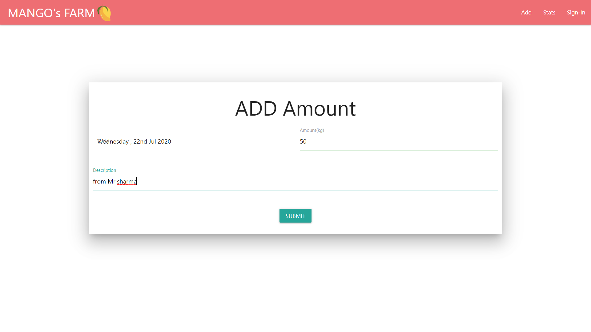
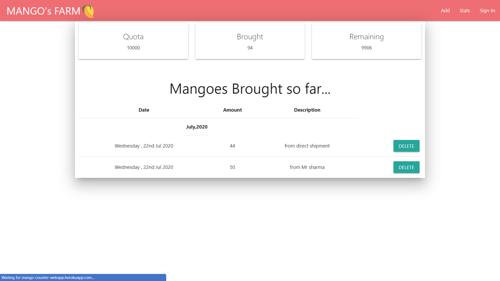

# mango-counter-webapp-client

this is modern webapp made in react.js .nodejs and mongodb to help in buisness ,made for one of my family friend,helpful for tracking buisness records in an interactive manner.
This app has super easy ui ,even a school going boy can handle.

### Technology Used

1:React.js : frontend js framework

2:Materialise.css : Css library for front end

3:Nodejs : for backend.

4: mongodb: for database

### Notes

this repo is showing only client side reactjs files ,for server side files , see my repo mango-counter-webapp

### for screenshots

  </img>
  </img>

### for preview

see the link in description section.
